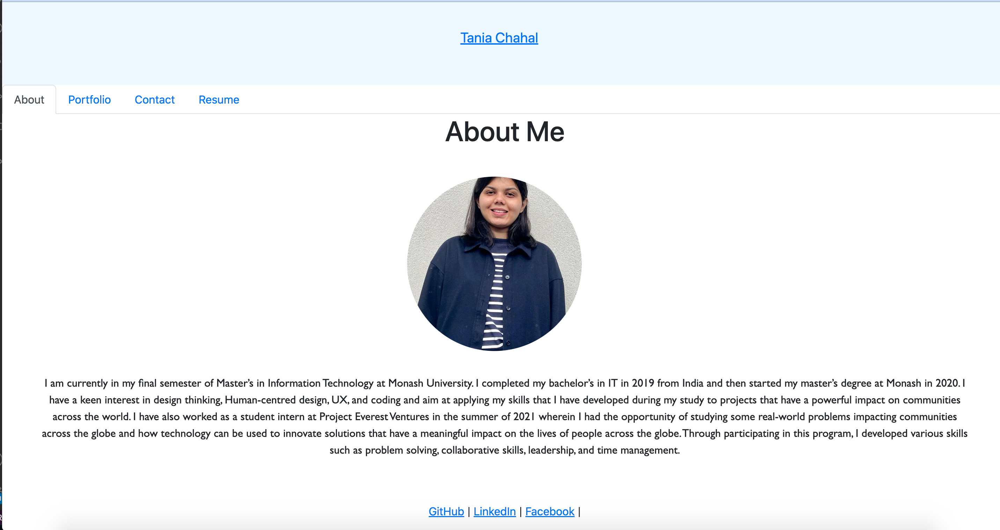
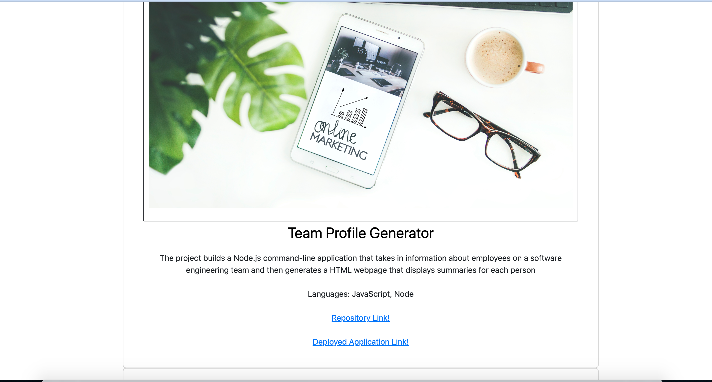
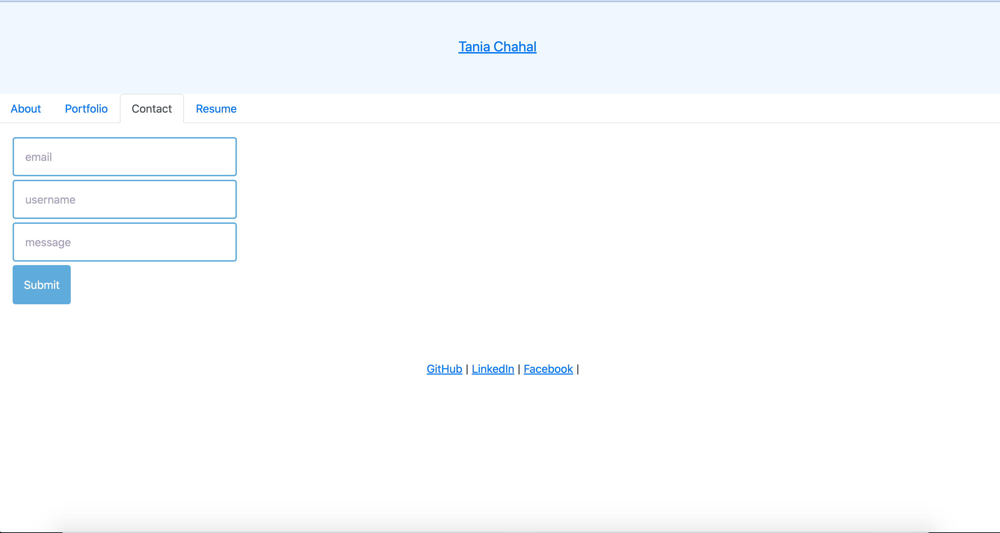
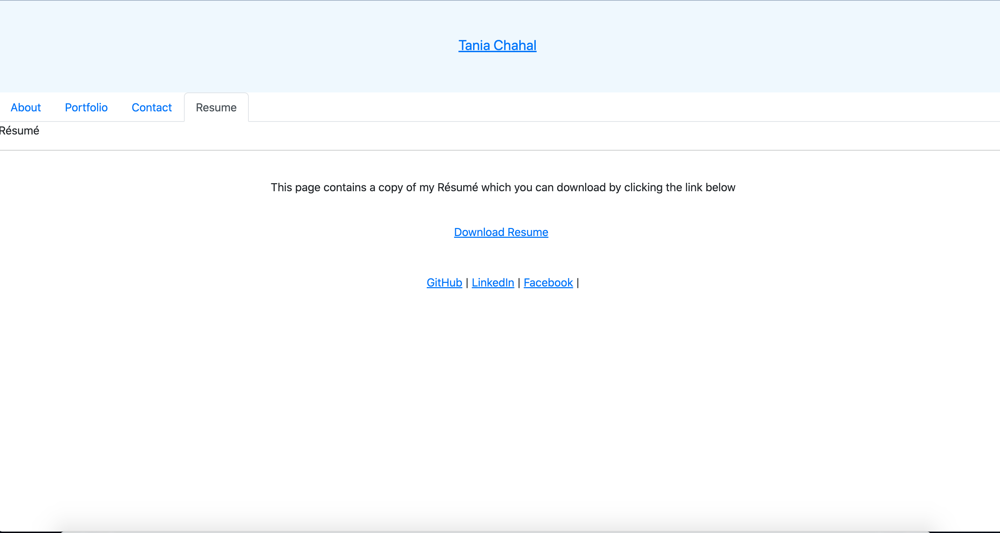

# react-user-portfolio

# Description

The following project creates a work portfolio for the user using react that has been deployed to GitHub Pages. The portfolio contains an about me section with the user's description, a portfolio section that contains links to the author's projects, a contact form and a resume section from where you can download the author's latest resume. 

# Installation

Clone the react-user-portfolio repository to your local machine. Start the application using the `npm run start` command.

# User Story

AS AN employer looking for candidates with experience building single-page applications
I WANT to view a potential employee's deployed React portfolio of work samples
SO THAT I can assess whether they're a good candidate for an open position

# Usage

The following images demonstrates the application functionality:

About Me Page:

Portfolio Page:

Contact Page:

Resume Page:

# Link to deployed react app on GitHub Pages

https://taniachahal97.github.io/react-user-portfolio/